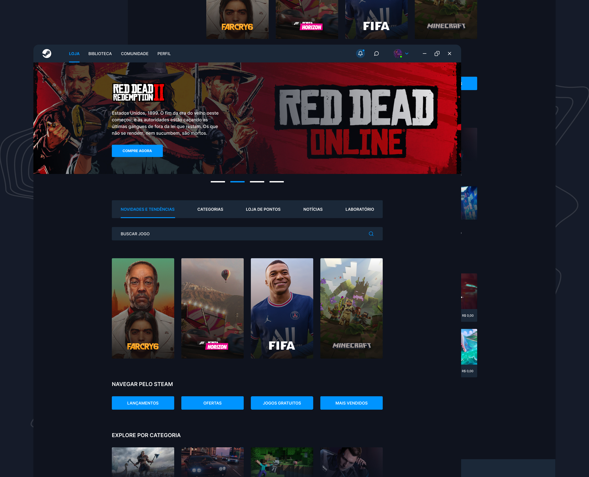

#   Projeto Redesign Steam

Nova interface responsiva para a página inicial da Steam.

## :computer: Como acessar:

Para acessar o projeto [clique aqui!](https://redesign-steam-letzc.vercel.app)

## 🛠️ Tecnologias usadas:
- 
- 
- 

## :bookmark: Autores:
- Desenvolvedora: [LetzC](https://github.com/LetzC)
- Layout Figma: [iuricode](https://github.com/iuricode)
